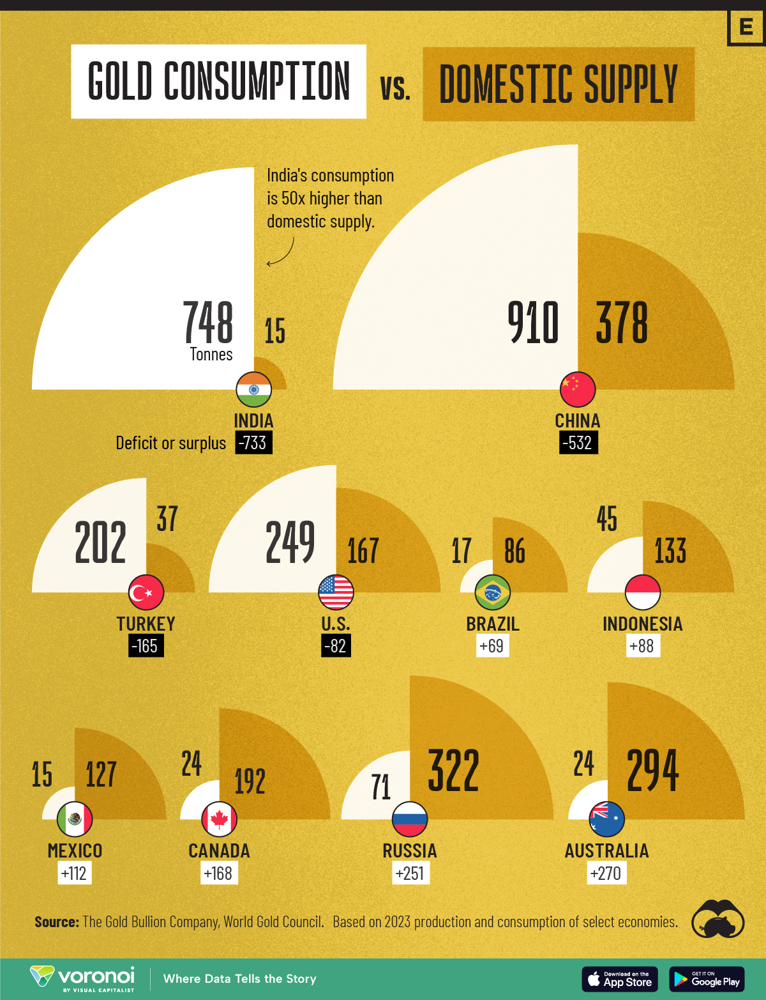

# Tugas Pertemuan 2 Visualisasi Data dan Informasi

**Nama : Raid Muhammad Naufal**\
**NIM : 122450027**\
**Kelas : RC**

# Bad Visualization 
## Gambar 1: The Top Countries by Total Beer Consumption in 2022

\
**Sumber:** *https://www.visualcapitalist.com/which-countries-drink-the-most-beer-3/*

Key Principles Visualization:
1. Strive for forms and functions (bentuk dan fungsi yang tepat)\
Visualisasi ini menggunakan bentuk yang menarik dengan memanfaatkan bentuk lingkaran menyerupai gelas bir yang relevan dengan tema konsumsi bir. Bentuk ini membantu menyampaikan konteks secara visual dan menarik perhatian. Namun secara fungsi, bentuk ini sedikit kurang tepat untuk perbandingan data. Penggunaan poligon (heksagon) dengan ukuran yang tidak selalu proporsional dapat membuat sulit untuk membandingkan ukuran konsumsi antar negara secara cepat. Sehingga visualisasi ini **tidak memenuhi prinsip strive for forms and functions**. 

2. Justifying the selection of everything we do (pembenaran dalam pemilihan desain)\
Penggunaan ikon negara dan ukuran poligon sesuai dengan volume konsumsi memberikan informasi yang jelas tentang kontribusi masing-masing negara terhadap total konsumsi bir. Penggunaan warna cokelat yang menyerupai warna bir juga relevan dengan tema. Tidak ada skala visual yang jelas untuk memastikan bahwa ukuran poligon benar-benar sesuai dengan angka konsumsi yang ditampilkan, yang dapat menimbulkan ambiguitas dalam memahami perbandingan. Sehingga visualisasi ini **tidak memenuhi prinsip justifying the selection of everything we do**.

3. Creating accessibility through intuitive design (menciptakan aksesibilitas melalui desain yang intuitif)\
Ikon negara-negara besar seperti AS, Cina, dan Brasil ditampilkan jelas dengan angka yang mudah dibaca. Desain keseluruhan cukup intuitif karena penonton bisa dengan cepat mengidentifikasi negara dengan konsumsi bir tertinggi berdasarkan ukuran poligon dan posisi sentral negara-negara utama. Penggunaan bentuk poligon yang tidak konsisten dapat menyebabkan kebingungan dalam menentukan ukuran relatif, terutama ketika ukuran geografis negara tidak mencerminkan konsumsi birnya. Sehingga visualisasi ini **tidak memenuhi prinsip creating accessibility through intuitive design**.

4. Never decieve the receiver (tidak menyesatkan)\
Secara umum, visualisasi ini tidak tampak menyesatkan karena menampilkan angka konsumsi bir dengan jelas untuk setiap negara. Meski tidak menyesatkan secara langsung, penggunaan ukuran poligon yang tidak selalu sebanding dengan data numerik dapat menciptakan persepsi yang salah mengenai perbedaan konsumsi bir antar negara. Sebagai contoh, Rusia dengan konsumsi 8.497 ribu kl memiliki area yang relatif kecil dibandingkan dengan AS dan Cina. Sehingga visualisasi ini **tidak memenuhi prinsip never decieve the receiver**.

Kesimpulan:\
Secara keseluruhan, visualisasi ini menarik tetapi memiliki kelemahan dalam menyampaikan data dengan akurat dan efisien dibandingkan dengan bentuk visualisasi yang lebih sederhana seperti grafik bar sehingga visualisasi ini dapat dikatakan visualisasi yang **buruk** karena tidak memenuhi keempat prinsip visualisasi.

## Gambar 2:

\
**Sumber:** *https://www.visualcapitalist.com/ranked-the-worlds-top-10-tax-havens/*

Key Principles Visualization:
1. Strive for forms and functions (bentuk dan fungsi yang tepat)\
Visualisasi ini menggunakan ilustrasi peta dunia dengan tanda berupa ikon kantong uang besar dan kecil yang mewakili jumlah kekayaan lepas pantai (offshore wealth) di beberapa negara. Peta dan ikon berfungsi baik dalam menyampaikan informasi mengenai negara-negara yang dikenal sebagai "tax havens" dengan skala dan jumlah kekayaan yang dimiliki di masing-masing yurisdiksi. Visualisasi ini juga menyertakan angka yang jelas untuk memperkuat pesan. Sehingga visualisasi ini **memenuhi prinsip strive for forms and functions**.

2. Justifying the selection of everything we do (pembenaran dalam pemilihan desain)\
 Pemilihan desain peta global dengan ikon uang memberikan justifikasi yang kuat. Setiap elemen yang dipilih dari peta, ikon kantong uang, hingga angka total kekayaan dalam USD berperan penting dalam memudahkan interpretasi data. Ikon kantong uang yang lebih besar ditempatkan di lokasi negara dengan kekayaan terbesar (Hong Kong dan Swiss) memberikan visualisasi yang sangat informatif. Sehingga visualisasi ini **memenuhi prinsip justifying the selection of everything we do**.

3. Creating accessibility through intuitive design (menciptakan aksesibilitas melalui desain yang intuitif)\
Gambar ini cukup intuitif. Penggunaan peta dunia membantu pembaca dengan cepat memahami lokasi yurisdiksi pajak tersebut. Besarnya ikon kantong uang secara visual membantu membedakan jumlah kekayaan, sehingga pembaca tidak hanya tergantung pada angka tetapi juga bisa memahami perbandingan secara visual. Teks yang menyoroti urutan negara dari 1 hingga 10 juga memudahkan pembaca untuk mengikuti informasi. Sehingga visualisasi ini **memenuhi prinsip creating accessibility through intuitive design**.

4. Never decieve the receiver (tidak menyesatkan)\
Data yang disajikan tampak jelas dan tidak menyesatkan. Setiap negara atau wilayah "tax haven" disertai dengan angka yang sesuai, urutan peringkatnya transparan. Namun, Jika kita membandingkan ukuran kantong uang Hong Kong dengan Singapura di gambar, secara visual, kantong uang Singapura terlihat tidak sesuai proporsinya dengan kantong uang Hong Kong. Secara proporsional, ukuran kantong uang Singapura di gambar terlalu kecil dibandingkan dengan Hong Kong. Idealnya, ukuran kantong Singapura seharusnya lebih besar, sekitar 57% dari ukuran kantong Hong Kong. Sehingga visualisasi ini **tidak memenuhi prinsip never decieve the receiver**.

Kesimpulan:\
Secara umum, visualisasi ini telah memenuhi tiga prinsip utama, namun visualisasi tidak memenuhi prinsip keempat, karena ukuran kantong uang Singapura secara visual tidak sesuai dengan ukuran kantong uang Hong Kong. Sehingga visualisasi ini dapat dikatakan visualisasi yang **buruk** karena tidak memenuhi prinsip keempat visualisasi.

# Good Visualization
## Gambar 1: Maingraphic Asset Class 2021

\
**Sumber:** *https://www.visualcapitalist.com/how-every-asset-class-currency-and-sp-500-sector-performed-in-2021/*

Key Principles Visualization:
1. Strive for forms and functions (bentuk dan fungsi yang tepat)\
Bentuk grafik bar horizontal sangat cocok digunakan di sini karena tujuan utama adalah untuk membandingkan performa dari berbagai kelas aset. Grafik bar memungkinkan audiens dengan cepat membedakan perbedaan persentase performa antar kelas aset secara jelas. Panjang bar menunjukkan kinerja relatif, dan ini membantu memperkuat pesan data secara visual. Sehingga visualisasi ini **memenuhi prinsip strive for forms and functions**.

2. Justifying the selection of everything we do (pembenaran dalam pemilihan desain)\ 
Setiap elemen dalam visualisasi ini dipilih dengan baik. Penggunaan warna gradasi yang berbeda tetapi tetap harmonis membantu audiens membedakan setiap kategori tanpa membingungkan. Labeling pada sumbu x dan y dilakukan dengan jelas, menunjukkan nama kelas aset dan persentasenya. Termasuk ikon untuk setiap aset (seperti ikon Bitcoin, ikon minyak, dll.), ditambahkan untuk memberikan konteks visual dan meningkatkan keterbacaan data. Pemilihan grafik bar horizontal juga memudahkan pembacaan kinerja masing-masing kelas aset secara linier. Sehingga visualisasi ini **memenuhi prinsip justifying the selection of everything we do**.

3. Creating accessibility through intuitive design (menciptakan aksesibilitas melalui desain yang intuitif)\
Penggunaan grafik bar horizontal dengan warna yang berbeda membantu pengguna langsung mengidentifikasi kategori yang berbeda. Urutan bar dari atas ke bawah berdasarkan performa juga mendukung pemahaman yang cepat, sehingga pengguna bisa segera mengetahui aset mana yang paling unggul. Elemen-elemen visual sederhana dan terorganisir dengan baik, membantu siapa pun, baik yang ahli maupun non-ahli, untuk memahami pesan dengan cepat tanpa perlu penjelasan lebih lanjut. Penggunaan ikon visual tambahan untuk aset seperti minyak dan emas juga membuat visualisasi ini lebih intuitif sehingga visualisasi ini **memenuhi prinsip creating accessibility through intuitive design**.

4. Never decieve the receiver (tidak menyesatkan)\
Pada visualisasi ini, semua data yang ditampilkan jelas, proporsional, dan sesuai dengan fakta yang disampaikan. Setiap bar yang lebih panjang memang mewakili aset dengan kinerja lebih tinggi, dan tidak ada skala atau proporsi yang berlebihan. Tidak ada penggunaan teknik seperti efek 3D atau penggabungan kategori yang membuat data tampak lebih baik atau lebih buruk daripada kenyataannya. Sehingga visualisasi ini **memenuhi prinsip never decieve the receiver**.

Kesimpulan:\
Visualisasi ini dapat dikatakan sebagai visualisasi yang **baik** karena memenuhi keempat prinsip visualisasi data dengan baik.

## Gambar 2: Gold Consumption vs. Domestic Supply

\
**Sumber:** *https://www.visualcapitalist.com/visualizing-gold-consumption-vs-domestic-supply/* 

Key Principles Visualization:
1. Strive for forms and functions (bentuk dan fungsi yang tepat)\
Visualisasi ini menggunakan bentuk setengah lingkaran untuk memvisualisasikan perbandingan antara konsumsi emas (di sebelah kiri) dan pasokan domestik (di sebelah kanan). Ini merupakan bentuk yang kreatif untuk menggambarkan perbedaan antara dua variabel, yang membantu audiens memahami defisit atau surplus secara cepat. Bentuk ini berhasil menyampaikan data secara visual, dengan ukuran area yang jelas menunjukkan perbedaan antara konsumsi dan pasokan. Gaya visual seperti ini sangat berguna untuk menyampaikan perbandingan relatif secara cepat. Sehingga visualisasi ini **memenuhi prinsip strive for forms and functions**. 

2. Justifying the selection of everything we do (pembenaran dalam pemilihan desain)\
Setiap elemen desain dipilih dengan pertimbangan yang matang. Warna yang berbeda untuk konsumsi dan pasokan membantu memisahkan dua kategori utama secara visual. Angka-angka yang besar dan mudah dibaca, serta perbedaan antara konsumsi dan pasokan yang ditandai dengan warna kuning dan putih, membuat visualisasi ini mudah untuk diikuti. Desain ini membuat perbandingan antar negara menjadi sangat jelas, dan defisit atau surplus ditunjukkan dengan sangat langsung melalui penggunaan angka negatif atau positif. Sehingga visualisasi ini **memenuhi prinsip justifying the selection of everything we do**.

3. Creating accessibility through intuitive design (menciptakan aksesibilitas melalui desain yang intuitif)\
 Visualisasi ini intuitif karena audiens dapat langsung memahami konteks dari perbandingan antara konsumsi dan pasokan emas. Warna kontras dan ukuran setengah lingkaran mempermudah interpretasi visual. Desain setengah lingkaran memperjelas defisit atau surplus, sehingga pengguna bisa langsung mengetahui negara mana yang memiliki surplus atau defisit pasokan emas. Penempatan bendera negara juga mempermudah identifikasi negara yang terlibat. Sehingga visualisasi ini **memenuhi prinsip creating accessibility through intuitive design**.

4. Never decieve the receiver (tidak menyesatkan)\
Visualisasi ini tidak menyesatkan. Data yang disajikan terlihat proporsional dan tepat dengan ukuran setengah lingkaran yang menunjukkan konsumsi dan pasokan emas dengan jelas. Setiap ukuran dan perbedaan visual mencerminkan data aktual yang disajikan. Tidak ada elemen yang berlebihan atau membingungkan. Meskipun menggunakan bentuk semi-lingkaran yang tidak konvensional, skala visual tetap tepat, dan informasi disampaikan secara jujur tanpa manipulasi visual. Sehingga visualisasi ini **memenuhi prinsip never decieve the receiver**.

Kesimpulan:\
Secara keseluruhan, visualisasi ini dapat dikatakan **baik** karena memenuhi keempat prinsip visualisasi data dengan sangat baik.
